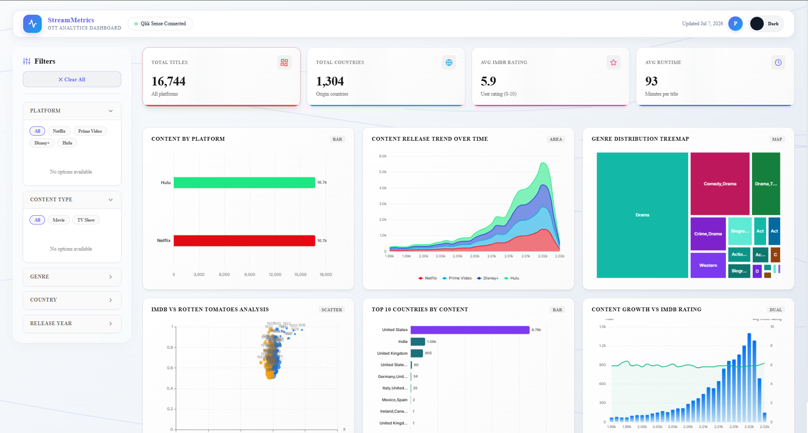
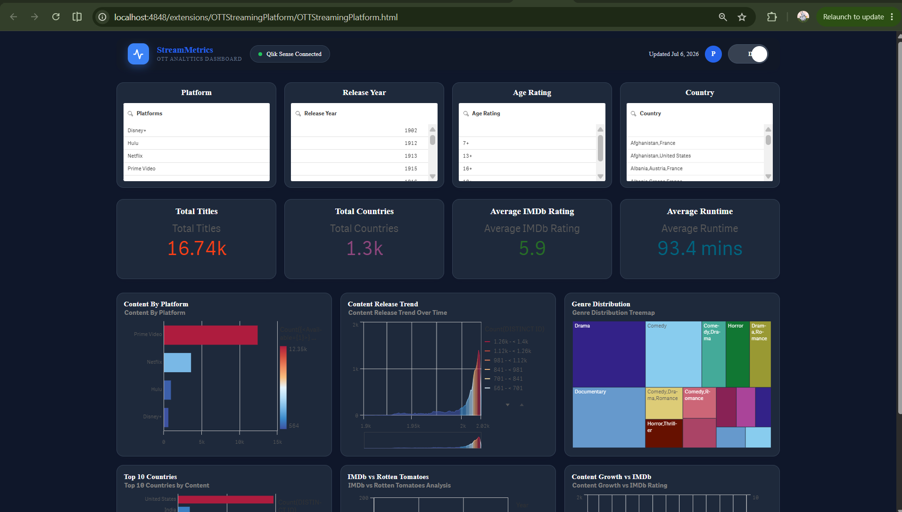

# 🎬 OTT Streaming Analytics Dashboard (Qlik Sense Mashup)

A modern and interactive OTT Streaming Analytics Dashboard built as a **Qlik Sense Mashup** using **Qlik Dev Hub**. The project embeds Qlik Sense visualizations into a custom web interface to provide an intuitive analytics experience for OTT platform data.

---

## 🚀 Features

- 📊 Interactive Qlik Sense visualizations
- 🎯 Dynamic filters
  - Platform
  - Release Year
  - Age Rating
  - Country
- 📈 KPI Cards
  - Total Titles
  - Total Countries
  - Average IMDb Rating
  - Average Runtime
- 📉 Analytics Visualizations
  - Content by Platform
  - Content Release Trend
  - Genre Distribution
  - Top 10 Countries
  - IMDb vs Rotten Tomatoes
  - Content Growth vs IMDb
- 🌗 Light & Dark Theme Toggle
- 🎨 Modern responsive dashboard UI
- 🔗 Embedded Qlik Sense objects using Qlik Dev Hub

---

## 🛠️ Technologies Used

- Qlik Sense Enterprise
- Qlik Dev Hub
- HTML5
- CSS3
- JavaScript
- RequireJS

---

## 📂 Project Structure

```
OTT-Streaming-Qlik-Mashup/
│
├── OTTStreamingPlatform.html
├── OTTStreamingPlatform.css
├── OTTStreamingPlatform.js
├── screenshots/
│   ├── dashboard-light.jpeg
│   ├── dashboard-dark.jpeg
│   
└── README.md
```

---

## 📷 Screenshots

### Light Theme



---

### Dark Theme



---


## 📊 Dashboard Overview

The dashboard provides insights into OTT streaming content through interactive Qlik Sense visualizations.

Users can analyze:

- Content distribution across platforms
- Release trends over time
- Genre-wise distribution
- Top producing countries
- IMDb vs Rotten Tomatoes ratings
- Growth trends of OTT content

Interactive filters allow users to drill down by platform, release year, age rating, and country.

---

## 💡 Highlights

- Custom UI built over Qlik Sense Mashup
- Professional dashboard styling
- Responsive layout
- Light/Dark mode support
- Embedded Qlik Sense analytics
- Interactive filtering and KPIs

---

## 👩‍💻 Author

**Priyanshi Varshney**

B.Tech CSE (Full Stack Development)  
UPES, Dehradun

---

## ⭐ Future Enhancements

- Improved sidebar navigation
- Additional OTT KPIs
- Enhanced mobile responsiveness
- More advanced Qlik visualizations
