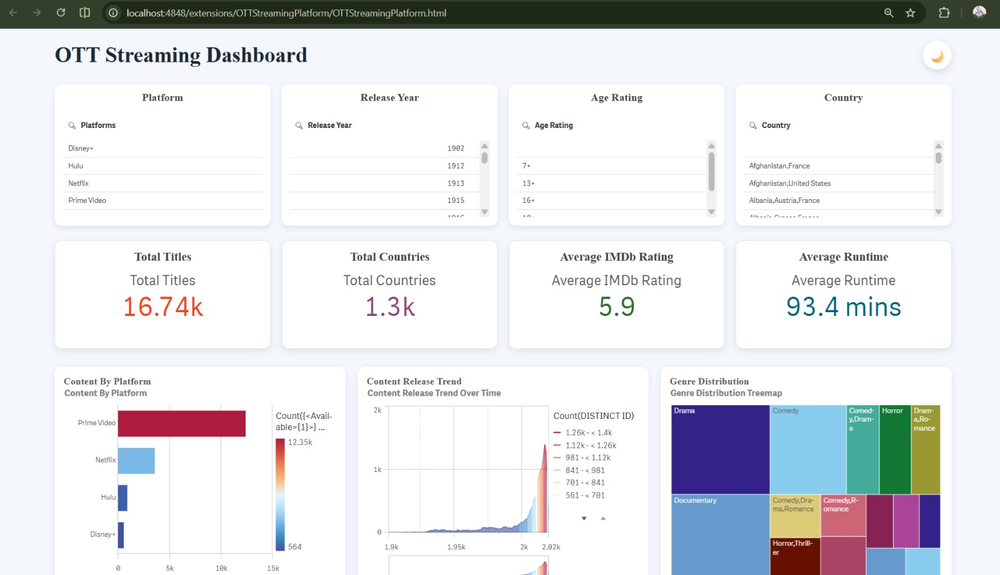
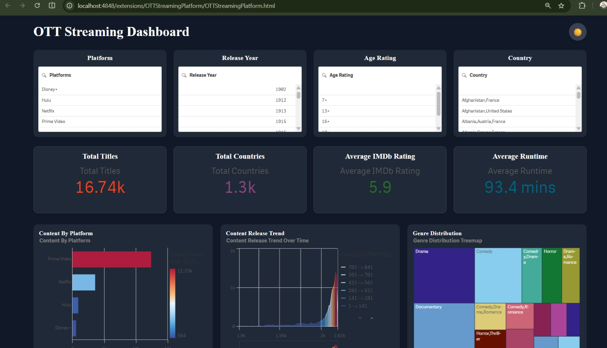
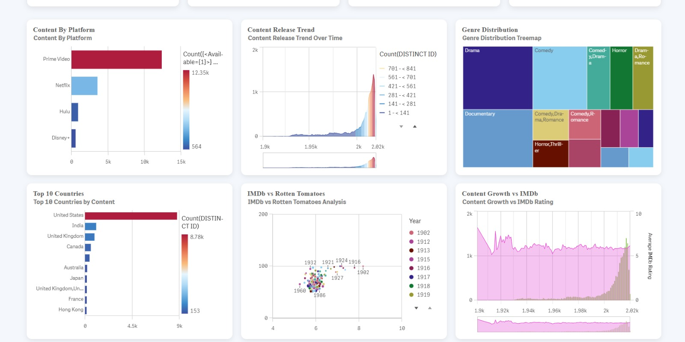
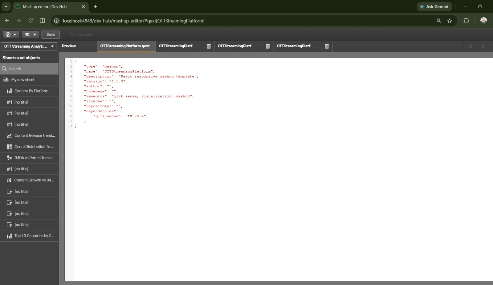

# OTT Streaming Qlik Mashup

An interactive OTT Streaming Analytics Dashboard built using **Qlik Sense Desktop Dev Hub** and **Qlik Capability APIs**.

## Features

- Interactive Filter Panes
- KPI Cards
- Content by Platform
- Content Release Trend
- Genre Distribution Treemap
- Top 10 Countries by Content
- IMDb vs Rotten Tomatoes Analysis
- Content Growth vs IMDb Rating
- Light / Dark Theme Toggle
- Responsive Dashboard Layout

## Tech Stack

- Qlik Sense Desktop
- Qlik Capability APIs
- HTML5
- CSS3
- JavaScript

---

## Dashboard (Light Theme)



---

## Dashboard (Dark Theme)



---

## Alternate Dashboard View



---

## Mashup Editor



---

## Project Structure

```
OTTStreamingPlatform
│
├── OTTStreamingPlatform.html
├── OTTStreamingPlatform.css
├── OTTStreamingPlatform.js
├── OTTStreamingPlatform.qext
├── wbfolder.wbl
├── screenshots
│   ├── dashboard-dark.jpeg
│   ├── dashboard-light.jpeg
│   ├── dashboard-light2.jpeg
│   └── mashup-editor.jpeg
└── README.md
```

## Author

**Priyanshi Varshney**
