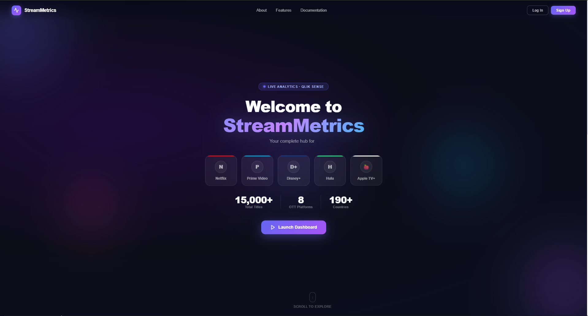
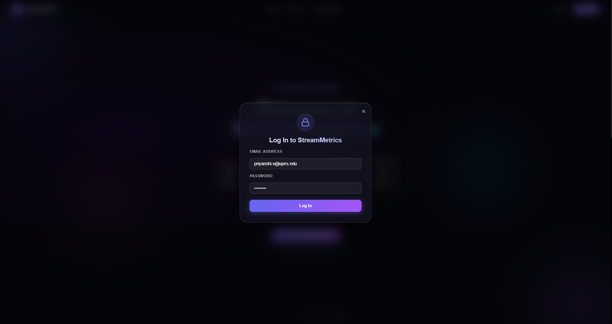
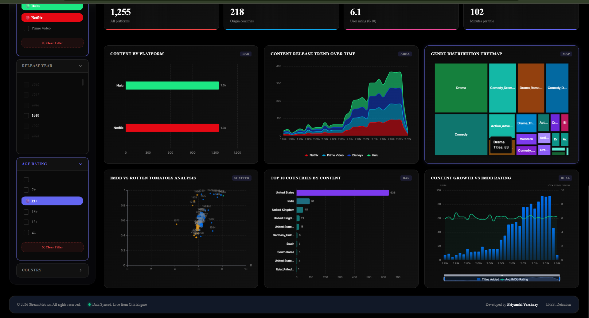

# OTT Streaming Analytics Dashboard

A modern, high-fidelity business intelligence web application built as a custom **Qlik Sense Mashup**. This application integrates real-time Qlik Sense engine data into an interactive, enterprise-grade web interface featuring an immersive landing splash screen, custom modal dialogs, interactive guided tours, real-time associative filtering, and advanced Apache ECharts analytics visualizations with dark and light mode support.

---

## 📸 Visual Overview & Screenshots

### 1. Landing Splash Page
An interactive splash screen with animated typewriter subtitles, glowing platform showcase cards, real-time counter metrics, and seamless transition into the analytics dashboard.



---

### 2. User Authentication & Feature Modals
Clean glassmorphic modal overlays supporting user login, registration, platform feature summaries, and interactive documentation.



---

### 3. Analytics Dashboard — Dark Theme (Default)
The primary workspace in dark mode, showcasing personalized time-aware hero greetings, active selection tracking, quick interactive tour launcher, accordion filters, KPI cards, and chart grid.


---

### 4. Analytics Dashboard — Light Theme
Full light-mode theme switcher support powered by dynamic CSS custom properties for vibrant readability in high-ambient light environments.


---

### 5. Advanced ECharts Analytics Visualizations
Comprehensive interactive visual analytics including content distribution bar charts, multi-year release area trends, genre treemaps, top country rankings, IMDb vs. Rotten Tomatoes scatter plots, and dual-axis growth curves.



---

## 🚀 Key Features

### 🌟 Interactive Landing Experience
*   **Animated Typewriter Subtitle:** Dynamic rotating headlines highlighting streaming data, catalog insights, and rating trends.
*   **Platform Showcase Cards:** Interactive cards for Netflix, Prime Video, Disney+, Hulu, and Apple TV+ displaying live catalog counts and growth indicators.
*   **Animated Counter Statistics:** RequestAnimationFrame-powered counter animations displaying total titles (15,000+), supported OTT platforms (8), and country metrics (190+).
*   **Smooth Scroll Parallax:** Parallax scroll and fade transitions guiding users seamlessly from splash to dashboard analytics.

### 🔐 Auth & Dialog System
*   **Pre-filled Demo Login:** Modal overlay supporting seamless login, registration, platform documentation, and feature highlights.
*   **Accessible Overlays:** Keyboard-friendly ESC listeners and backdrop click-to-close behavior.

### 🎯 Hero Header & Interactive Tour
*   **Time-Aware Dynamic Greeting:** Customized header greeting adaptively greeting the user based on the local time of day ("Good morning / afternoon / evening, Priyanshi!").
*   **Live Qlik Selection Banner:** Real-time breadcrumb summary showing active filters currently applied across the dataset.
*   **Automated Interactive Tour:** Step-by-step walkthrough highlighting dashboard components and auto-filtering to demonstrate live Qlik recalculations.

### 🔍 Dynamic Accordion Filtering & Associative Search
*   **Qlik Associative Engine Integration:** Accordion filter lists bind directly to Qlik engine list objects (`qListObject`), maintaining true green/white/grey associative states (selected, possible, excluded).
*   **Platform Brand Accents:** Visual selection indicators matching platform color identities (Netflix red, Prime blue, Hulu green, Disney navy).
*   **Granular & Global Clear Controls:** Isolated clear buttons for each filter category alongside a global dashboard reset control.

### 📊 KPI Scorecards
*   **Smooth Count-Up Animations:** Numeric counters animating dynamically whenever data selections update.
*   **Key Executive Metrics:**
    1. **Total Titles:** Total streaming catalog volume.
    2. **Global Coverage:** Number of unique content-producing countries.
    3. **Average IMDb Rating:** Overall audience sentiment score.
    4. **Average Runtime:** Catalog average content duration in minutes.

### 📈 Apache ECharts Analytics Grid
1.  **Content Distribution by Platform:** Bar chart visualizing content allocation across major streaming providers.
2.  **Content Release Trend Over Time:** Gradient area chart showing multi-year release progression.
3.  **Genre Distribution:** Treemap displaying hierarchical breakdown of genres.
4.  **Top 10 Countries by Volume:** Horizontal ranking chart for content production hubs.
5.  **IMDb vs. Rotten Tomatoes Analysis:** Scatter plot correlating audience and critic rating metrics.
6.  **Content Growth vs. IMDb Rating:** Dual-axis chart comparing annual volume additions against average quality ratings.

### 🎨 Theme & Styling Architecture
*   **Instant Dark / Light Toggle:** Smooth theme switcher with persistent user preference storage.
*   **Glassmorphic Design System:** Styled using modern CSS variables, backdrop blur filters, and subtle ambient glowing gradients.
*   **Responsive Layout:** Flexbox & CSS Grid structure optimized across desktop and widescreen displays.

---

## 🛠️ Technologies Used

*   **Platform Engine:** Qlik Sense Enterprise / Qlik Dev Hub Mashup API
*   **Chart Library:** Apache ECharts v5 (via CDN & custom render adapters)
*   **UI Framework:** Vanilla HTML5, Custom CSS3 (CSS Variables, Flexbox, CSS Grid)
*   **Scripting & Logic:** Vanilla JavaScript (ES6 Modules & IIFE patterns)
*   **Module Loader:** RequireJS (Qlik Sense runtime dependency)
*   **Typography:** Google Fonts (Inter)

---

## 📂 Project Structure

```
OTT-Streaming-Qlik-Mashup/
├── OTTStreamingPlatform.html       # Application entrypoint & HTML structure
├── OTTStreamingPlatform.css        # Base layout & top header styles
├── OTTStreamingPlatform.js         # Qlik connection & RequireJS entrypoint
├── OTTStreamingPlatform.qext       # Qlik extension manifest metadata
├── README.md                       # Project documentation
│
├── css/
│   ├── animations.css              # Entrance keyframes & glow animations
│   ├── background.css              # Ambient background gradients
│   ├── cards.css                   # KPI scorecards & chart container styles
│   ├── charts.css                  # ECharts container grids & responsiveness
│   ├── filters.css                 # Accordion dropdowns, checkboxes, & filter pills
│   ├── landing.css                 # Interactive landing splash page styles
│   └── theme.css                   # Light/Dark mode CSS custom property tokens
│
├── js/
│   ├── adapters.js                 # Field mappings, measures, & data formatting
│   ├── background.js               # Background animation controller
│   ├── charts.js                   # ECharts configuration, rendering, & resize observers
│   ├── dashboard.js                # Core dashboard boot & module orchestrator
│   ├── filters.js                  # Qlik ListObject binding & filter UI controller
│   ├── hero.js                     # Interactive hero section greeting & quick tour manager
│   ├── hypercube.js                # Session objects & Qlik HyperCube data fetching
│   ├── kpi.js                      # KPI calculations & count-up animations
│   ├── landing.js                  # Landing page animations, typewriter, & modal manager
│   ├── theme.js                    # Dark/Light theme switching & local storage persistence
│   └── utils.js                    # Number formatters, debounce, & window resize helpers
│
└── screenshots/
    ├── landingPage.png             # Interactive landing splash page preview
    ├── login.png                   # Auth & feature modal dialog preview
    ├── dashboard-dark.png          # Dark theme dashboard preview
    ├── dashboard-light.png         # Light theme dashboard preview
    └── charts.png                  # ECharts visualization grid detail preview
```

---

## 🎨 Layout & Design Tokens

| Design Token | Light Theme | Dark Theme (Default) |
| :--- | :--- | :--- |
| **Page Background** | `#F0F4FB` (Gradient) | `#090A0F` (Solid / Glow) |
| **Card Surface** | `#FFFFFF` | `#161B22` |
| **Primary Accent** | `#6366F1` (Indigo) | `#8B5CF6` (Purple) |
| **Text Primary** | `#0F172A` | `#F0F6FC` |
| **Text Muted** | `#64748B` | `#8B949E` |
| **Border Color** | `rgba(0, 0, 0, 0.08)` | `rgba(255, 255, 255, 0.1)` |

---

## 💻 Setup & Usage Instructions

1. **Deploy to Qlik Sense:**
   * Copy or clone the repository folder into your Qlik Sense Extensions directory:
     `C:\Users\<User>\Documents\Qlik\Sense\Extensions\OTTStreamingPlatform`
2. **Open Qlik Sense Desktop / Enterprise:**
   * Launch Qlik Sense Desktop or navigate to your Qlik Sense Hub.
3. **Access Mashup:**
   * Open the mashup URL in your web browser:
     `http://localhost:4848/extensions/OTTStreamingPlatform/OTTStreamingPlatform.html`
4. **Explore Dashboard:**
   * Experience the **Landing Page** and click **"Launch Dashboard"**.
   * Click **"Interactive Tour"** inside the hero panel to run an automated walkthrough of the analytics features.

---

## 👤 Author

**Priyanshi Varshney**  
*B.Tech Computer Science Engineering — Full Stack Development*  
UPES, Dehradun
